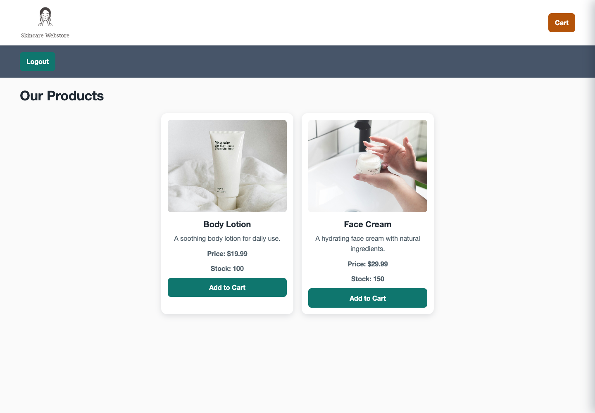
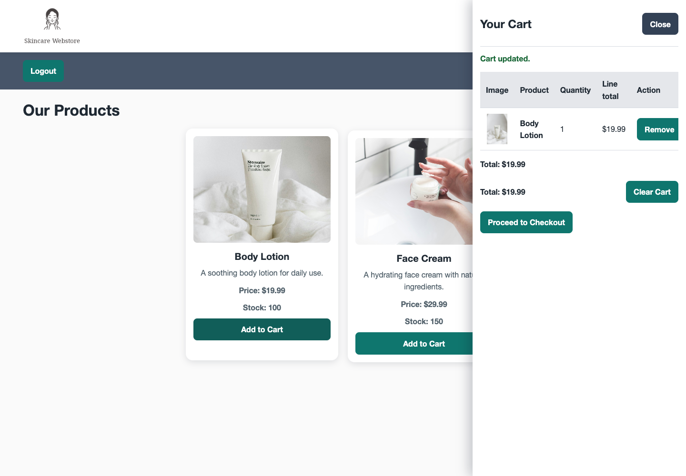
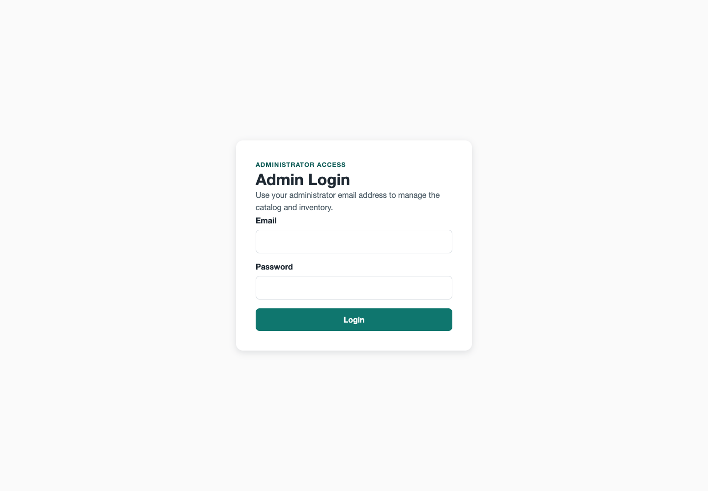
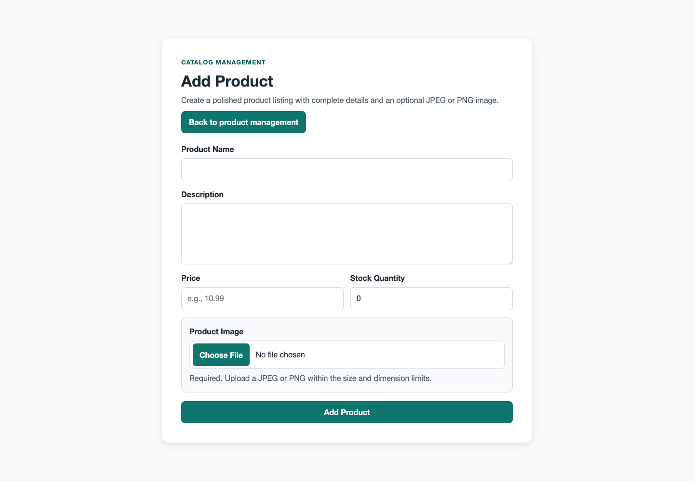
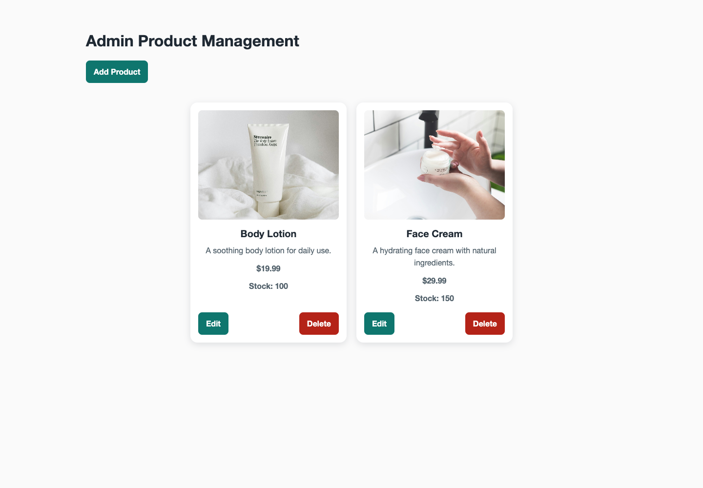

# Spring Boot Webstore

[](https://github.com/ThomasRoyProjects/ExampleSpringbootWebstore/actions/workflows/ci.yml)

A server-rendered e-commerce reference application built with Java 17, Spring Boot, Spring Security, Thymeleaf, JPA, Flyway, MySQL, and Docker Compose.

The project demonstrates session-isolated carts, server-authoritative checkout, persisted receipts, role-separated administration, validated image uploads, accessible responsive UI, and reproducible local/container deployment.

## Screenshots

| Storefront | Accessible cart drawer |
| --- | --- |
|  |  |

| Administrator login | Product creation |
| --- | --- |
|  |  |



## Core behavior

- Customer registration and form login use normalized email addresses with BCrypt password hashing.
- Canonical `ROLE_CUSTOMER` and `ROLE_ADMIN` authorization; disabled users cannot authenticate.
- CSRF protection on every browser mutation.
- One server-side cart per HTTP session; browser storage is not trusted.
- Checkout calculates subtotal, tax, shipping, and final price from current database values inside an explicit transaction.
- Orders persist authenticated customer ownership; receipts enforce principal ownership with non-leaking 404 responses for cross-user or unowned lookups.
- Same-session checkouts serialize through the transaction commit boundary and coordinate with cart mutations to prevent duplicate ordering.
- Multi-item checkouts acquire pessimistic product row locks in deterministic product-id order to prevent reversed-cart lock-order deadlocks.
- Orders and immutable order lines are persisted and reloadable by confirmation number for their owner or administrators.
- Product administration uses validated DTOs and a single `/admin/products/**` route family.
- Image uploads accept only decoded JPEG/PNG content, enforce size/dimension limits, generate server filenames, and prevent path traversal.
- Flyway owns the schema for both H2 development and MySQL production.
- Health endpoints expose liveness/readiness without publishing sensitive actuator data.

## Architecture

```text
Browser / Thymeleaf
        |
Spring MVC controllers + validated request DTOs
        |
Transactional application services
        |
Spring Data JPA repositories
        |
H2 (development/tests) or MySQL (Compose/production)
```

Important boundaries:

- `CartService` owns session-scoped cart state.
- `CheckoutService` and `OrderService` own pricing, stock mutation, order creation, and receipt retrieval.
- `ProductService` owns catalog persistence.
- `ImageStorageService` is the only filesystem/image boundary.
- `SecurityConfig` and the admin login filter enforce route authorization.

## Local development

Requirements: Java 17. The Gradle wrapper downloads the required Gradle version.

```bash
./gradlew bootRun
```

The default development profile uses a durable local H2 database at `./data/webstore`, runs Flyway migrations, and seeds the two demo products idempotently. Open <http://localhost:8080>.

No administrator is created unless bootstrap is explicitly enabled:

```bash
APP_ADMIN_BOOTSTRAP_ENABLED=true \
APP_ADMIN_EMAIL=local-admin@example.com \
APP_ADMIN_PASSWORD='replace-with-a-strong-password' \
./gradlew bootRun
```

Bootstrap creates an administrator only when no admin account exists; it does not reset credentials on subsequent starts.

## Docker Compose

Docker Compose runs the production profile with a private MySQL service, durable database/upload volumes, health checks, and a non-root application container. MySQL is not published to the host.

```bash
cp .env.example .env
# Replace every placeholder in .env
docker compose up --build
```

Open <http://localhost:8080>. Check service health with:

```bash
docker compose ps
curl --fail http://localhost:8080/actuator/health
```

Stop the application without deleting data:

```bash
docker compose down
```

Delete local container data only when intentionally resetting the environment:

```bash
docker compose down --volumes
```

## Configuration

| Variable | Purpose | Required in Compose |
| --- | --- | --- |
| `MYSQL_PASSWORD` | Least-privilege `webstore` database password | Yes |
| `MYSQL_ROOT_PASSWORD` | MySQL initialization root password | Yes |
| `WEBSTORE_PORT` | Host port mapped to application port 8080 | No; defaults to `8080` |
| `APP_ADMIN_BOOTSTRAP_ENABLED` | Enable one-time administrator creation | No; defaults to `false` |
| `APP_ADMIN_EMAIL` | Bootstrap administrator email address | Only when bootstrap is enabled |
| `APP_ADMIN_PASSWORD` | Bootstrap administrator password | Only when bootstrap is enabled |

Production datasource credentials are supplied by environment variables. No password is committed to source control.

## Routes

| Method | Route | Access | Purpose |
| --- | --- | --- | --- |
| `GET` | `/` | Public | Landing/catalog preview |
| `GET`, `POST` | `/register` | Public | Customer registration |
| `GET`, `POST` | `/login` | Public | Customer authentication |
| `GET` | `/products` | Authenticated | Storefront |
| `GET` | `/cart/items` | Authenticated | Reusable cart fragment |
| `POST` | `/cart/add`, `/cart/remove`, `/cart/clear` | Authenticated + CSRF | Session cart mutations |
| `GET`, `POST` | `/checkout` | Authenticated + CSRF | Review and place order |
| `GET` | `/orders/{orderNumber}` | Authenticated (owner / admin) | Persisted receipt |
| `GET`, `POST` | `/admin/login` | Public form / admin session | Administrator authentication |
| `GET`, `POST` | `/admin/products/**` | `ROLE_ADMIN` + CSRF for mutations | Catalog and image management |
| `GET` | `/actuator/health` | Public | Liveness/readiness status |

## Tests

```bash
./gradlew test
```

The integration tests defend registration privilege boundaries, duplicate-user handling, session cart isolation, server-authoritative totals, stock mutation, receipt persistence and ownership boundaries, cross-user receipt denial, concurrent same-session serialization, deterministic multi-item locking order, and failed-checkout cart preservation.

## Security notes

This is a portfolio/reference application, not a payment processor. Checkout is intentionally simulated and never collects card data. Before internet deployment, add an external secret manager, TLS termination, database backups, rate limiting, and environment-specific monitoring.

## License

Released under the [MIT License](LICENSE).
